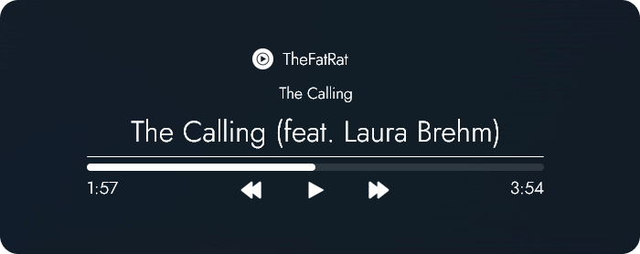
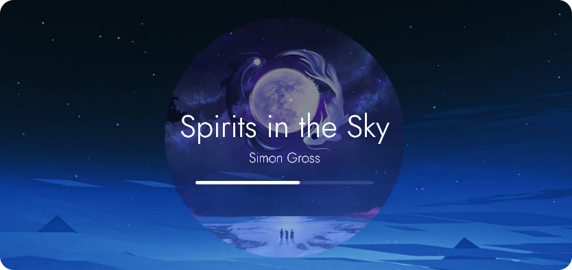
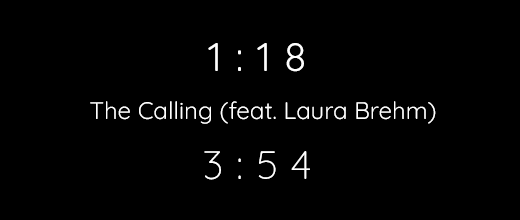
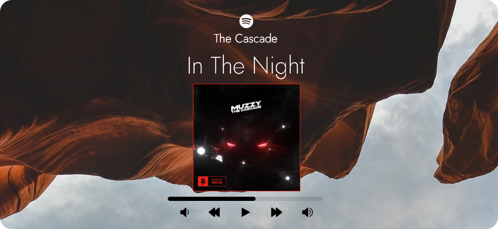
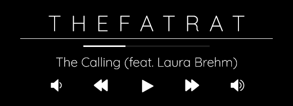
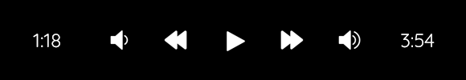

# 💧 Rainmeter: S.A.S MusicPlayer 🎵

### A simple, highly customizable music player that you can adjust and fine-tune to suit your desktop needs.

Currently comes with 2 types of alignment (Left & Center) and a separate cover art, each having NowPlaying & [WebNowPlaying](https://github.com/tjhrulz/WebNowPlaying) variants.

Each part of the player (title, artist, bar, etc.) can be customized to your preferences _(up to a certain extent)_.

The skin will load using the default values defined in the variables file, which can be accessed through the context menu and select `Edit Variables_[ALIGNMENT_TYPE].inc`.
You can set the media player (for NowPlaying variant), adjust cover art variables and colors through the context menu as well.

All variables are labeled into small groups/sections + comments to guide users on what each setting does.

## ⚠️ Requirements

- WebNowPlaying browser extension: [Mozilla](https://addons.mozilla.org/en-US/firefox/addon/webnowplaying-companion/) | [Chrome/Edge](https://chrome.google.com/webstore/detail/webnowplaying-companion/jfakgfcdgpghbbefmdfjkbdlibjgnbli)
- [Rainmeter](https://www.rainmeter.net/) version 4.5.13 or above
- Spicetify for spotify support **(desktop version)** - [Installation guide](https://spicetify.app/docs/getting-started)*

_*After installing Spicetify, go to Advanced Usage -> Extensions -> Web Now Playing and install the extension_

## 🖼️ Styles

### Default

  
  

### Custom (examples)

  
  
  

  
  
  

  
  

## Additional Notes
- The skin is adjusted for **1920x1080** screens (user with high DPI screens may need to re-adjust the settings)

## 📝 Credits

- [WebNowPlaying](https://github.com/tjhrulz/WebNowPlaying) by tjhrulz
- Icons from [Iconify](https://iconify.design/)
- Quicksand font from [Google Fonts](https://fonts.google.com/specimen/Quicksand)

## ⏳ Updates

### v1.0
- Initial Release

### v1.1
- Added color adjustments for each part of the player
- Moved variables file into a folder