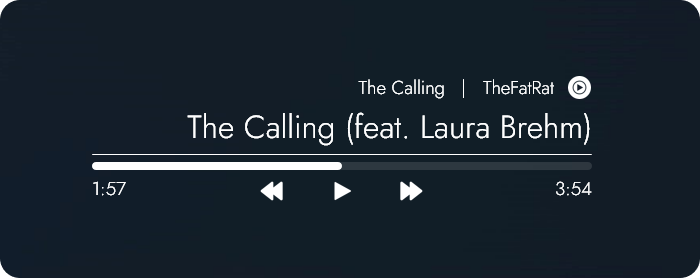

# 💧 Rainmeter: S.A.S MusicPlayer 🎵

### A highly customizable music player that you can adjust and fine-tune to suit your desktop preferences.

- Comes with 3 alignment types (Left, Center, Right) and a separate cover art, each having NowPlaying & [WebNowPlaying](https://github.com/keifufu/WebNowPlaying-Redux) variants.

- Each part of the player (title, artist, progress bar, controls, etc.) can be customized to your preferences _(up to a certain extent)_.

- Easily customize skin through the UI, which can be opened with middle mouse click on the player and cover art, or through the context menu

- Access the variables file for more advanced usage. All settings are labeled into small groups/sections + comments for guidance.

## ⚠️ Requirements

- [Rainmeter](https://www.rainmeter.net/)
- WebNowPlaying-Redux browser extension: [Mozilla](https://addons.mozilla.org/en-US/firefox/addon/webnowplaying-redux/) | [Chrome/Edge](https://chrome.google.com/webstore/detail/webnowplaying-redux/jfakgfcdgpghbbefmdfjkbdlibjgnbli)
- (Optional) Spicetify for Spotify support **(desktop version)** - [Installation guide](https://spicetify.app/docs/getting-started)*

_*After installing Spicetify, in the webpage, go to Advanced Usage -> Extensions -> Web Now Playing section and follow the instructions to install it_

## 🖼️ Styles

### Default

  
  
  

### Custom (examples)

  
  
  
  
  

 
## Additional Notes
- Currently the skin is adjusted for **1920x1080** screens (user with high DPI screens may need to re-adjust the settings)

## 📝 Credits

- [WebNowPlaying-Redux](https://github.com/keifufu/WebNowPlaying-Redux) by keifufu & tjhrulz
- [CursorColor](https://forum.rainmeter.net/viewtopic.php?f=27&t=23375) by jsmorley
- [Mouse.dll](https://github.com/NighthawkSLO/Mouse.dll) by NighthawkSLO
- [ColorPickerUI](https://github.com/deathcrafter/ColorPickerUI) by deathcrafter
- Icons from [Iconify](https://iconify.design/)
- Jost font from [Google Fonts](https://fonts.google.com/specimen/Jost)

## ⏳ Updates

### v1.0

- Initial Release

### v1.1

- Added color adjustments for each part of the player
- Moved variables file into a folder

### v1.2

- Added User Interface
  - Can be opened with middle mouse click on the player and cover art or through the context menu
  - UI for colors in progress (variables file can still be edited)
- Improved display quality on some icons
- Various bug fixes and improvements

### v1.2.1

- UI: Fixed long input values from extending outside the skin border
- UI: Adjusted skin load in settings to toggle
- UI: Added a toggle to switch between different variants of alignment settings
- UI: Adjusted settings width & height slightly
- UI: Adjusted text and description on some settings

### v1.3

- Added right alignment
- UI additions & improvements:
  - Added UI for colors + gradient customizations
  - Added functionality to select colors using ColorPickerUI (original by [deathcrafter](https://github.com/deathcrafter/ColorPickerUI))
  - Adjusted certain values to be selectable instead of inputting manually
  - Adjusted overall text description, position & default font to improve user experience
  - Various bug fixes and improvements
- Changed default skin font to Jost
- Adjusted variables name & default values

### v1.3.1

- Updated WebNowPlaying to use the new WebNowPlaying-Redux
- Added more player icons for supported websites
- Optimized some .ini configs for UI settings
- Minor fixes and improvements