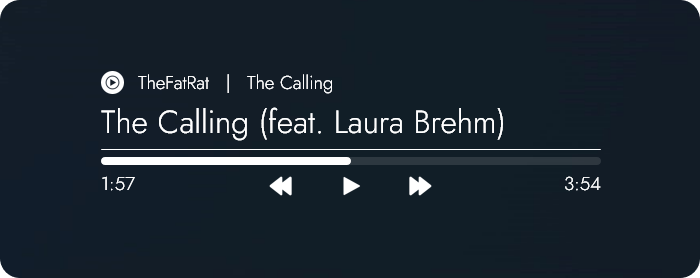
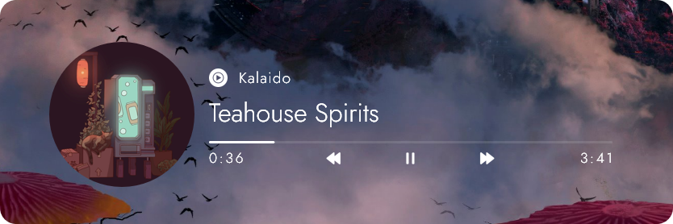

# 💧 Rainmeter: S.A.S MusicPlayer 🎵

### A simple, highly customizable music player that you can adjust and fine-tune to suit your desktop needs.

Currently comes with 2 types of alignment (Left & Center) and a separate cover art, each having NowPlaying & [WebNowPlaying](https://github.com/tjhrulz/WebNowPlaying) variants.

Each part of the player (title, artist, bar, etc.) can be customized to your preferences _(up to a certain extent)_.

The skin can be edited through the settings UI, which can be opened with middle mouse click on the player or cover art (recommended), or through the context menu.

For advanced usage, the variables file can be accessed through the context menu as well. All variables are labeled into small groups/sections + comments to guide users on what each setting does.

## ⚠️ Requirements

- WebNowPlaying browser extension: [Mozilla](https://addons.mozilla.org/en-US/firefox/addon/webnowplaying-companion/) | [Chrome/Edge](https://chrome.google.com/webstore/detail/webnowplaying-companion/jfakgfcdgpghbbefmdfjkbdlibjgnbli)
- [Rainmeter](https://www.rainmeter.net/) version 4.5.13 or above
- Spicetify for spotify support **(desktop version)** - [Installation guide](https://spicetify.app/docs/getting-started)*

_*After installing Spicetify, go to Advanced Usage -> Extensions -> Web Now Playing and install the extension_

## 🖼️ Styles

### Default

  
  

### Custom (examples)

  
  
  

  
  
  

  
  

## Additional Notes
- The skin is adjusted for **1920x1080** screens (user with high DPI screens may need to re-adjust the settings)

## 📝 Credits

- [WebNowPlaying](https://github.com/tjhrulz/WebNowPlaying) by tjhrulz
- Icons from [Iconify](https://iconify.design/)
- Quicksand font from [Google Fonts](https://fonts.google.com/specimen/Quicksand)

## ⏳ Updates

### v1.0
- Initial Release

### v1.1
- Added color adjustments for each part of the player
- Moved variables file into a folder

### v1.2
- Added User Interface
  - Can be opened with middle mouse click on the player and cover art or through the context menu
  - UI for colors in progress (variables file can still be edited)
- Improved display quality on some icons
- Various bug fixes and improvements